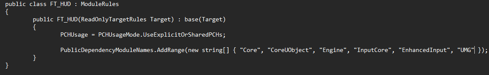
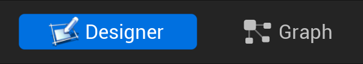
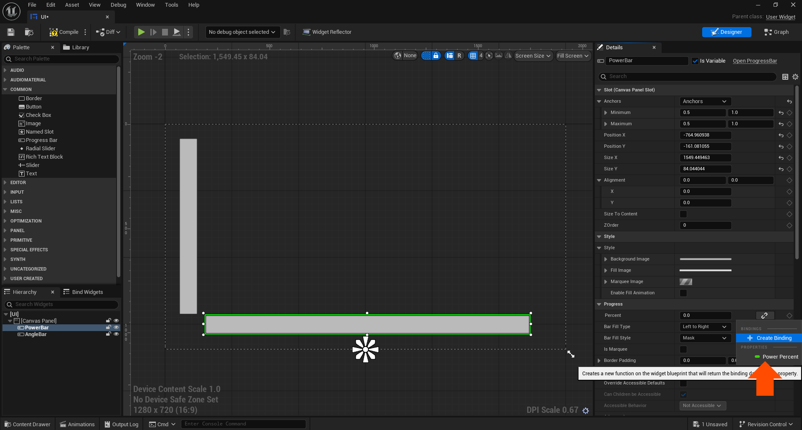

# FT\_HUD

This is the focus topic for working with the GUI and and interactive elements. In this you will make a tradition cannon style game using two power bars/

## Overview
Controls:
Space bar only.
This is a basic cannon style game you have two bars pre-built, bottom is your power and the left you cannon angle. when you press space you will freeze the current bar and the next will begin moving. **Note in the Build.cs file I added "UMG"**

# Where to find the relevant scripts
In C++ the main script is the **CannonCharacter**. However, for todays session you will need to look in the **UI** folder and open the **UI Widget** I have built for you. 

The widget has two views when you open it, the **Designer**, which is the building of the UI Canvas and the **Graph**, which controls the UI through a buildprint interface.

You will also notice i have used the Naive State Machine pattern, with Enums.

For the variables in the canvas, note i have **binded** the variables to the **progress bar** percent value:

# Task
Try to first implement the angle bar to aid the cannons firing.

# Challenges
Test Your Might

## Easy 
- Extend the floor so the projectile doesn't fall off the floor
- Make it so pressing the space after firing resets the game back to the start
- Adjust the canvas to have a text field, and two variable, a start pos and current pos, the text should tell the player how far they shot

## Medium
- Adjust so the Angle and Power have different max values, e.g. the angle probably shouldn't go past 80
- Adjust the speed so it factors in the current value and is faster near the **ideal** value e.g. 100 for power 45 for angle
- Adjust the canvas to track the speed as well as distance

## Hard 
- Can you adjust to track and show the player fastest shot and the furtherest distance
- Can you adjust the progress bar (the bar that shows the power), to use a gradient, where green is the ideal value and red is a none ideal value
- Can you get the camera to follow the last shot

# Reference
Content is made by Connah Kendrick (Connah.Kendrick@mmu.ac.uk) using the Unreal Engine 3rd Person Template for the MMU 1st year Game Mechanics Module taught to both Game Development and Game Design Students. 

